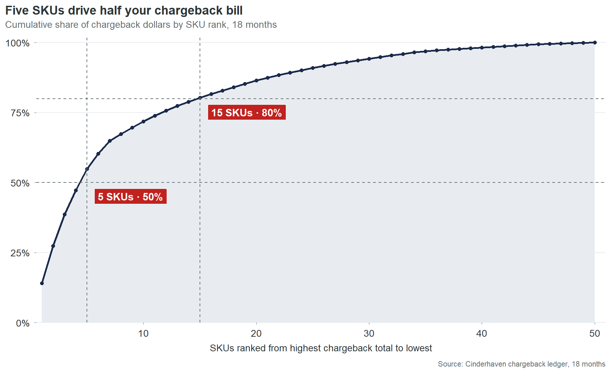

```{r setup}
#| include: false
suppressPackageStartupMessages({ library(dplyr) })
smf <- readRDS("../output/frames/sku_master_full.rds")
top1  <- smf |> arrange(desc(chargeback_total)) |> slice(1)
top5  <- smf |> arrange(desc(chargeback_total)) |> slice(1:5)
total_cb <- sum(smf$chargeback_total)
top5_share <- sum(top5$chargeback_total) / total_cb
```

:::: {.cr-section}

::: {#cr-pareto}

:::

The Cinderhaven catalog has 90 SKUs and 4 contracted retailers. Over 18 months, retailers deducted **$88,000** in chargebacks from settlement payments. @cr-pareto

But that total is not evenly spread. [@cr-pareto]{pan-to="-30%,0%" scale-by="1.6"}

`r format(top5$sku, justify = "none")[1]` — **`r top5$product_name[1]`** — alone carries `r sprintf("$%s", formatC(round(top5$chargeback_total[1]), big.mark = ","))` in chargebacks over the 18-month window. That's `r sprintf("%.1f%%", 100 * top5$chargeback_total[1] / total_cb)` of the total bill. One SKU. [@cr-pareto]{pan-to="-30%,0%" scale-by="2.4"}

The next four — `r paste(top5$sku[2:5], collapse = ", ")` — bring the cumulative share to **`r sprintf("%.0f%%", 100 * top5_share)`** of every chargeback dollar across the catalog. [@cr-pareto]{pan-to="-15%,0%" scale-by="1.8"}

Fifteen SKUs reach 80% of the total. Forty SKUs out of ninety carry **zero** chargebacks at all. [@cr-pareto]{scale-by="1.0"}

This is not a catalog-wide crisis. It is a concentrated, addressable problem — and every SKU in the top of this curve has a name and a specific data defect that's been generating the charges every month since the day the SKU was entered. [@cr-pareto]{scale-by="1.0"}

::::

\

**Continue to the full audit report →** [Audit report](report.html) · [Executive tearsheet](tearsheet.pdf) · [Monday Morning Dashboard](dashboard.html)
