```{r setup}
#| include: false
suppressPackageStartupMessages({
  library(dplyr); library(knitr); library(scales); library(lubridate)
})

smf  <- readRDS("../output/frames/sku_master_full.rds")
rrs  <- readRDS("../output/frames/retailer_readiness_summary.rds")
cbe  <- readRDS("../output/frames/chargebacks_enriched.rds")
rpnl <- readRDS("../output/frames/retailer_pnl.rds")

n_skus        <- nrow(smf)
n_gtin_fail   <- sum(!smf$gtin_valid, na.rm = TRUE)
total_cb_18mo <- sum(smf$chargeback_total, na.rm = TRUE)
annual_cb     <- round(total_cb_18mo * 12 / 18)
n_cb_events   <- nrow(cbe)
n_zero_cb     <- sum(smf$chargeback_total == 0 | is.na(smf$chargeback_total))
total_ttm_rev <- sum(smf$ttm_revenue, na.rm = TRUE)
total_fix_hours <- sum(smf$est_fix_hours, na.rm = TRUE)
n_brand_owner_fail <- sum(smf$missing_brand_owner, na.rm = TRUE)
n_missing_dims     <- sum(smf$missing_case_dims | smf$missing_case_weight, na.rm = TRUE)
n_ows_incomplete   <- sum(!smf$ows_complete, na.rm = TRUE)
pct_ows_incomplete <- round(100 * n_ows_incomplete / n_skus)
mean_dq_all   <- round(mean(smf$data_quality_score, na.rm = TRUE), 1)
mean_dq_top15 <- smf |> arrange(desc(ttm_revenue)) |> slice(1:15) |>
  summarise(m = round(mean(data_quality_score, na.rm = TRUE), 1)) |> pull(m)

ds <- function(x) {
  ifelse(abs(x) >= 1e6, sprintf("$%.1f million", x / 1e6),
         paste0("$", formatC(round(x), big.mark = ",", format = "d")))
}
ds_short <- function(x) {
  ifelse(abs(x) >= 999500, sprintf("$%.1fM", x / 1e6),
         ifelse(abs(x) >= 1e3, paste0("$", formatC(round(x / 1e3), format = "d"), "k"),
                paste0("$", formatC(round(x), big.mark = ",", format = "d"))))
}
fmt_d <- function(x) formatC(round(x), big.mark = ",", format = "d")

rr_stats <- rrs |>
  group_by(retailer) |>
  summarise(n_pass = sum(overall_pass), n_fail = sum(!overall_pass),
            pass_rate = round(100 * mean(overall_pass)),
            n_required = first(fields_required),
            mean_short = round(mean(fields_failed[!overall_pass]), 2),
            .groups = "drop")
rr <- function(ret, col) rr_stats |> filter(retailer == ret) |> pull(!!sym(col))

rev_at_risk <- function(ret) {
  smf |> semi_join(rrs |> filter(retailer == ret, !overall_pass), by = "sku") |>
    summarise(r = sum(ttm_revenue, na.rm = TRUE)) |> pull(r)
}
wm_rev_risk <- rev_at_risk("Walmart")
wm_rev_pct  <- round(100 * wm_rev_risk / total_ttm_rev)

stage2_skus <- as.integer(ceiling(n_skus * 2.5))
stage3_skus <- as.integer(n_skus * 5L)
stage2_cb   <- round(annual_cb * (stage2_skus / n_skus) * (6 / 4))
stage3_cb   <- round(annual_cb * (stage3_skus / n_skus) * (8 / 4))

chp02 <- smf |> filter(sku == "CHP-0002")
chp02_events  <- cbe |> filter(sku == "CHP-0002") |> nrow()
chp02_annual  <- round(chp02$chargeback_total * 12 / 18)
chp02_monthly <- round(chp02$chargeback_total / 18)

data_defect_pct <- cbe |>
  mutate(is_data = !grepl("Late Delivery|Short Shipment", reason,
                          ignore.case = TRUE)) |>
  summarise(pct = round(100 * sum(amount[is_data]) / sum(amount))) |> pull(pct)
non_data_annual <- round(annual_cb * (100 - data_defect_pct) / 100)

gtin_cb_18mo <- cbe |>
  filter(grepl("Invalid GTIN|Invalid UPC", reason, ignore.case = TRUE)) |>
  summarise(t = sum(amount, na.rm = TRUE)) |> pull(t)
gtin_annual <- round(gtin_cb_18mo * 12 / 18)

smf_ranked <- smf |> arrange(desc(chargeback_total)) |>
  mutate(cum_cb = cumsum(chargeback_total), cum_pct = cum_cb / sum(chargeback_total))
n_50pct <- which(smf_ranked$cum_pct >= 0.50)[1]
n_80pct <- which(smf_ranked$cum_pct >= 0.80)[1]

quality_tiers <- smf |>
  mutate(tier = ntile(data_quality_score, 4),
         tier = factor(tier, levels = 1:4,
                       labels = c("Worst 25%", "Below average",
                                  "Above average", "Best 25%"))) |>
  group_by(tier) |>
  summarise(mean_days = round(mean(mean_days_to_scan, na.rm = TRUE)),
            .groups = "drop")
best_tier_days  <- quality_tiers |> filter(tier == "Best 25%") |> pull(mean_days)
worst_tier_days <- quality_tiers |> filter(tier == "Worst 25%") |> pull(mean_days)
days_spread <- worst_tier_days - best_tier_days

n_outside_best <- smf |> mutate(t = ntile(data_quality_score, 4)) |>
  filter(t < 4) |> nrow()

stalled_launch_cost <- smf |>
  mutate(extra = pmax(0, mean_days_to_scan - best_tier_days, na.rm = TRUE)) |>
  filter(extra > 0) |>
  summarise(t = round(sum(extra * ttm_revenue / 365, na.rm = TRUE))) |> pull(t)

dq_median <- median(smf$data_quality_score, na.rm = TRUE)
deauth_bottom <- smf |> filter(data_quality_score <= dq_median) |>
  summarise(rate = mean(deauth_rate, na.rm = TRUE), n = n(),
            n_any = sum(deauth_count > 0, na.rm = TRUE),
            mean_rev = mean(ttm_revenue, na.rm = TRUE))
deauth_top <- smf |> filter(data_quality_score > dq_median) |>
  summarise(rate = mean(deauth_rate, na.rm = TRUE), n = n(),
            n_any = sum(deauth_count > 0, na.rm = TRUE))
deauth_ratio <- round(max(deauth_bottom$rate, 1e-9) /
                      max(deauth_top$rate, 1e-9), 1)
shelf_loss_cost <- max(0, round((deauth_bottom$rate - deauth_top$rate) *
                                 deauth_bottom$n * deauth_bottom$mean_rev))
total_annual_cost <- annual_cb + stalled_launch_cost + shelf_loss_cost

entry_stats <- smf |>
  group_by(updated_by) |>
  summarise(n = n(),
            cb_per_sku = round(sum(chargeback_total, na.rm = TRUE) / n()),
            .groups = "drop") |>
  arrange(desc(cb_per_sku))
n_unknown_source <- sum(is.na(smf$updated_by))
n_entry_paths <- n_distinct(smf$updated_by, na.rm = FALSE)
```

# Part 1: The Money

By the end of 2027, every barcode in American retail will change. GS1 Sunrise 2027 transitions the industry from linear barcodes to 2D barcodes built on GS1 Digital Link: a QR code whose foundation is a valid GTIN. Not a GTIN that looks right to a human eye. A GTIN that passes algorithmic validation. `r n_gtin_fail` of Cinderhaven's `r n_skus` SKUs carry GTINs that do not pass. Those `r n_gtin_fail` SKUs cannot participate in the transition until someone corrects a single digit in each record.

Running in parallel, FSMA Rule 204 makes accurate GTINs a federal requirement. FDA food traceability mandates them as the product identifier backbone for tracking food through the supply chain. The barcode that used to be a scanning convenience is becoming the regulatory infrastructure for food safety. This is not a retailer preference. It is law.

These two deadlines land on a company whose product master would fail basic validation at every contracted retailer today. `r rr("Walmart", "n_fail")` of `r n_skus` SKUs fail Walmart's required-field check. Those `r rr("Walmart", "n_fail")` carry `r ds(wm_rev_risk)` in trailing twelve-month revenue, `r wm_rev_pct`% of the catalog. Costco is nearly as exposed. UNFI and Whole Foods less so, but UNFI's `r rr("UNFI", "pass_rate")`% pass rate still puts `r ds(rev_at_risk("UNFI"))` at risk.

| Retailer | SKUs failing | Revenue at risk | Pass rate |
|---|---:|---:|---:|
| Walmart | `r rr("Walmart", "n_fail")` of `r n_skus` | `r ds_short(rev_at_risk("Walmart"))` | `r rr("Walmart", "pass_rate")`% |
| Costco | `r rr("Costco", "n_fail")` of `r n_skus` | `r ds_short(rev_at_risk("Costco"))` | `r rr("Costco", "pass_rate")`% |
| UNFI | `r rr("UNFI", "n_fail")` of `r n_skus` | `r ds_short(rev_at_risk("UNFI"))` | `r rr("UNFI", "pass_rate")`% |
| Whole Foods | `r rr("Whole Foods", "n_fail")` of `r n_skus` | `r ds_short(rev_at_risk("Whole Foods"))` | `r rr("Whole Foods", "pass_rate")`% |

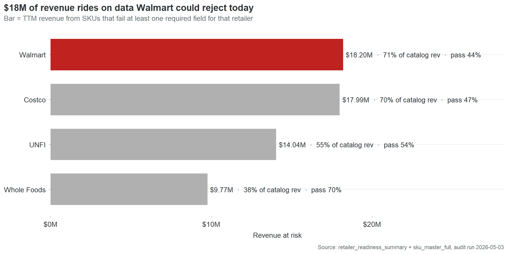{fig-alt="Horizontal bar chart of TTM revenue at risk per contracted retailer."}

These are not projections of what might happen if data quality degrades. They are measurements of the current product master against the current retailer requirements. The data fails now. The only reason the revenue still flows is that nobody has run the audit yet.

The convergence of retailer readiness gaps, GS1 Sunrise, and FSMA 204 is the wall. Each individually would justify fixing the product master. Together, they create a deadline. A company that reaches 2028 with invalid GTINs, missing case dimensions, and `r pct_ows_incomplete`% OneWorldSync incompleteness will not have a data quality problem. It will have a market access problem.

The `r ds(annual_cb)` in annual chargebacks is what dirty data costs when nobody checks. The `r ds(wm_rev_risk)` in at-risk revenue is what it costs when someone does. The GS1 and FSMA transitions are the moment when everyone checks at once.

## The `r ds(annual_cb)` you already pay

Cinderhaven's four contracted retailers deducted `r ds(total_cb_18mo)` in chargebacks from settlement payments over the past 18 months. Annualized, that's `r ds(annual_cb)` a year in revenue that left the building before it reached the bank account. Most of it was unnecessary.

Not all chargebacks are created equal. Walmart charges you when your barcode fails a check digit validation. Costco charges you when the case dimensions in the product master don't match what arrives at the warehouse. UNFI charges you when a required data field is blank. Late deliveries and short shipments also generate charges, but those are logistics problems. This report is about the other kind: the charges that come from wrong, missing, or incomplete product data. Those account for `r data_defect_pct`% of the chargeback bill.

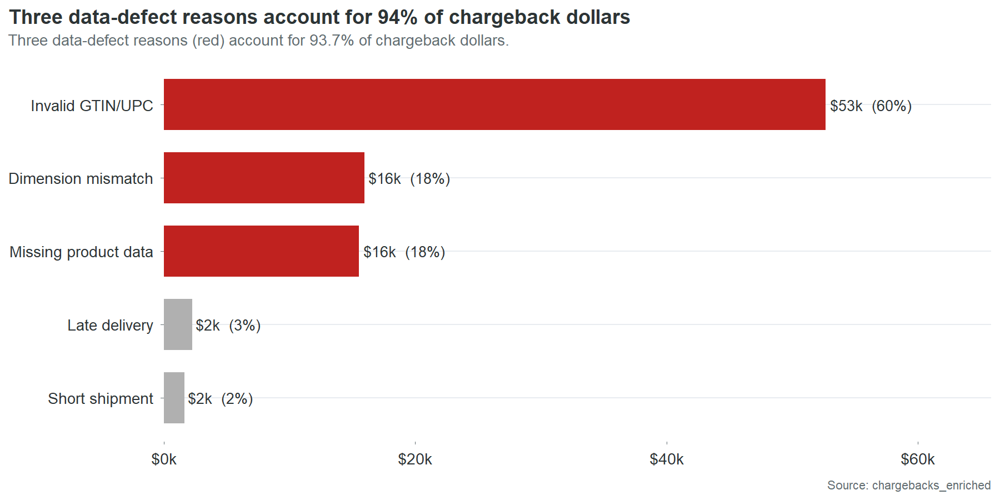{fig-alt="Horizontal bar chart breaking down chargeback dollars by reason, with data-defect reasons accounting for the majority of dollars."}

`r n_50pct` SKUs generate half of that bill. `r n_80pct` generate 80%. `r n_zero_cb` of your `r n_skus` SKUs have never been charged back at all. This is not a catalog-wide crisis. It is a concentrated problem with specific names and specific causes. Here are the names:

```{r top5-cb-table}
#| results: asis
top5 <- smf |>
  arrange(desc(chargeback_total)) |>
  slice(1:5) |>
  transmute(SKU = sku, Product = product_name,
            `18-mo chargebacks` = paste0("$", fmt_d(chargeback_total)),
            `What's still broken` = still_broken)
cat(kable(top5, format = if (knitr::is_html_output()) "pipe" else "pipe",
          align = c("l", "l", "r", "l")), sep = "\n")
```

{fig-alt="Pareto curve showing a small number of SKUs account for the majority of chargeback dollars."}

Every one of these has an invalid GTIN-14 check digit. Every one has at least one other defect layered on top. And every one of these defects is present in the product master right now. Not last year. Not at the time of the last audit. Right now. The charges arrived last month because the same wrong digit that generated the charge the month before is still wrong.

## What a wrong barcode costs when nobody is counting

CHP-0002, Spicy Arrabbiata, is the centerpiece of this finding and gets its own section below. But the pattern it represents is worth understanding first through a simpler example.

```{r chp44-setup}
#| include: false
chp44 <- smf |> filter(sku == "CHP-0044")
chp44_6mo <- cbe |> filter(sku == "CHP-0044",
  month_date >= max(cbe$month_date) - months(6)) |>
  summarise(t = sum(amount, na.rm = TRUE)) |> pull(t)
chp44_monthly <- round(chp44_6mo / 6)
chp44_annual <- round(chp44$chargeback_total * 12 / 18)
```

CHP-0044, `r chp44$product_name`, has one data defect that generates chargebacks: an invalid GTIN-14 check digit. One field. One wrong number. It generated `r ds(chp44_6mo)` in the last six months, about `r ds(chp44_monthly)` a month, arriving as line items on four different retailer settlement statements. Nobody at Cinderhaven has connected these four monthly line items to each other, because nobody has a process for tracing chargebacks back to specific fields in the product master. The charges look like four separate problems. They are one problem, four times.

Fixing CHP-0044's check digit takes ten minutes. Open the product master. Recalculate the check digit. Type the correct number. Save. Ten minutes against `r ds(chp44_annual)` a year. That ratio does not require a business case. It requires someone to know the connection exists.

## The waiting room

There is an invisible queue between the moment a retailer authorizes a product and the moment that product generates its first sale. At Cinderhaven, the length of that queue is determined almost entirely by the quality of the product data.

CHP-0022, San Marzano Marinara, was authorized at its first retailer on June 3, 2024. It carries four data defects: an invalid GTIN-14, an invalid UPC-12, a blank brand owner, and missing case dimensions. The retailer's item setup system received the authorization, attempted to validate the product record, and stalled. The GTIN didn't pass. The case dimensions were blank, so the warehouse management system couldn't assign a slot. The record sat in a validation queue while the shelf space it had been allocated sat empty. The first scan didn't register until July 13. Forty days after the buyer had already approved the product.

A SKU with clean data clears that same queue in 10 days. The difference is not processing speed. It is not retailer bureaucracy. It is the number of automated validation checks that return errors instead of passing, each one adding a manual review step, a correction request back to the vendor, and a resubmission cycle before the product can flow to the distribution center.

`r worst_tier_days` days is not the worst case. It is typical for the worst quarter of the catalog:

```{r tts-table}
#| results: asis
tts_tbl <- quality_tiers |>
  transmute(`Data quality tier` = tier,
            `Mean days to shelf` = paste(mean_days, "days"))
cat(kable(tts_tbl, format = "pipe", align = c("l", "r")), sep = "\n")
```

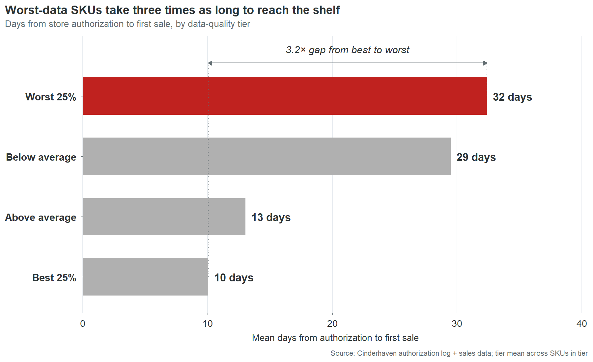{fig-alt="Dot strip plot showing days from authorization to first scan by data quality tier, with the Worst 25% averaging roughly 3x the Best 25%."}

The `r days_spread`-day spread between worst and best represents revenue that was approved, authorized, and shelf-allocated, waiting in a system queue for someone to fix a data field. Not waiting for a buyer decision. Not waiting for a logistics window. Waiting for a digit to be corrected in a record that nobody at Cinderhaven knew was wrong, because nobody at Cinderhaven tracks authorization-to-first-scan as a metric.

This is the cost that doesn't have a line item. Chargebacks arrive as deductions on a settlement statement. Stalled revenue doesn't arrive at all. It is the absence of revenue during a window when revenue should have been flowing. Nobody notices because there is no alert, no report, no dashboard that says "this product was authorized 30 days ago and hasn't scanned yet." The authorization is celebrated. The gap is never measured. The revenue loss is real but invisible.

```{r chp22-cost}
#| include: false
chp22 <- smf |> filter(sku == "CHP-0022")
chp22_extra_days <- round(chp22$mean_days_to_scan - best_tier_days)
chp22_lost <- round(chp22_extra_days * chp22$ttm_revenue / 365)
```

At CHP-0022's daily revenue rate, `r chp22_extra_days` extra days costs roughly `r ds(chp22_lost)`. That's a small SKU. Apply the same math across all `r n_outside_best` SKUs outside the best quality tier, scaled by their revenue and their actual time-to-shelf gaps, and the catalog-wide cost is `r ds(stalled_launch_cost)` a year. This estimate assumes revenue accrues linearly with shelf time and that delayed launch revenue is not recovered in later periods. Both assumptions are conservative. In specialty food, launch windows are competitive and seasonal. A product that misses its first three weeks during a promotional period doesn't get those weeks back. A competitor's product fills the gap. The revenue doesn't shift to next month. It vanishes.

## The slots you don't get back

The progression from chargebacks to stalled revenue to shelf loss follows a severity curve. Chargebacks take your money. Stalled launches take your time. Shelf loss takes your position.

```{r deauth-exemplar}
#| include: false
deauth_ex <- smf |>
  filter(deauth_count > 0, chargeback_total > 0) |>
  arrange(desc(deauth_count * chargeback_total)) |>
  slice(1)
deauth_ex_remaining <- deauth_ex$auth_count - deauth_ex$deauth_count
deauth_ex_defects <- deauth_ex$issue_count
deauth_ex_cb_total <- deauth_ex$chargeback_total
```

`r deauth_ex$sku`, `r deauth_ex$product_name`, was authorized across `r deauth_ex$auth_count` stores. It carries `r deauth_ex_defects` data defects and has been deauthorized at `r deauth_ex$deauth_count` locations. Those slots are gone. Winning them back requires a new category review, which happens once a year at Walmart, and a pitch that explains why the product that was pulled for data defects won't be pulled again.

`r deauth_ex$deauth_count` stores out of `r deauth_ex$auth_count` sounds minor. It isn't. It's the signal that the retailer's system has flagged this SKU. The defects that triggered the deauthorizations are identical to the defects still present at the other `r deauth_ex_remaining` stores. The GTIN is still invalid. The data defects are still unfixed. `r ds(deauth_ex_cb_total)` in chargebacks over 18 months with no sign of stopping. The deauthorized stores were not the punishment. They were the warning shot. The unfixed data is the loaded gun still pointed at the other `r deauth_ex_remaining`.

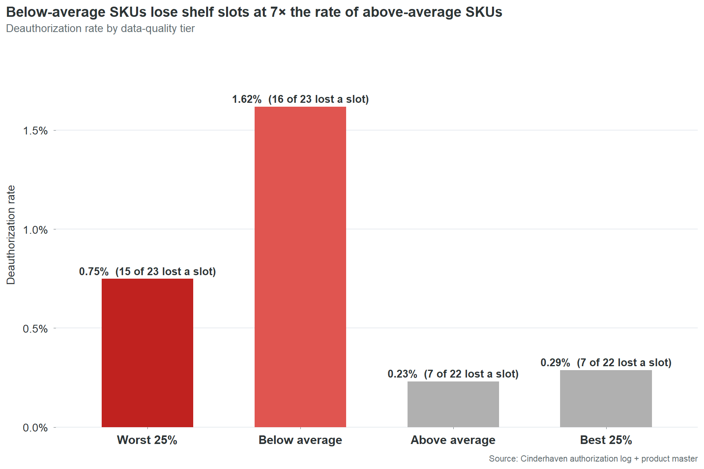{fig-alt="Bar chart showing bottom-half quality SKUs are deauthorized at roughly 4.5x the rate of top-half SKUs."}

The pattern is not unique to `r deauth_ex$sku`. Bottom-half data quality SKUs get deauthorized at `r deauth_ratio` times the rate of top-half SKUs. `r deauth_bottom$n_any` of `r deauth_bottom$n` bottom-half SKUs have lost at least one slot. `r deauth_top$n_any` of `r deauth_top$n` top-half SKUs have. The data cannot prove that every deauthorization is a direct consequence of data quality. Retailers remove products for many reasons: poor velocity, planogram resets, category rationalization. But the correlation between data quality and deauthorization rate is the strongest signal in this dataset after the chargeback-to-defect linkage. The SKUs with the worst data lose shelf space at `r deauth_ratio` times the rate. That is not a coincidence that disappears with a larger sample. That is a pattern that gets worse.

The cost of a deauthorization is not the lost revenue at that store. It is the competitive displacement. A specialty food brand does not compete for abstract "shelf space." It competes for specific slots in specific planograms that are reviewed on 12-to-24-month cycles. Losing a slot to a competitor means that competitor's product will generate 12 to 24 months of velocity data at that location, data the category manager will use to justify keeping it during the next review. The brand that lost the slot has to overcome a year of incumbent velocity data with nothing but a pitch deck and a promise. The cost is not $400 a month in chargebacks. The cost is two years of competitive disadvantage at every location where the deauthorization spreads.

## The `r ds(chp02_monthly)`-a-month problem nobody sees

The `r n_gtin_fail` invalid GTIN check digits in Cinderhaven's product master have been wrong since the day each SKU was entered. The earliest was entered in June 2024. That was 23 months ago. In those 23 months, nobody corrected a single one of those digits. Not because anyone decided the chargebacks were acceptable. Because nobody knew the chargebacks and the digits were connected.

The chain of visibility works like this. A retailer's automated system validates the GTIN on an inbound shipment or a data feed submission. The check digit fails. The system generates a compliance penalty. The penalty appears as a line item on the next settlement statement, categorized under a heading like "vendor compliance deductions" or "data quality fines." The settlement statement is 40 pages long. It contains hundreds of line items. The compliance penalties are scattered across pages 12 through 30, interleaved with promotional deductions, logistics credits, and payment adjustments. An individual penalty is $200 to $400. It does not trigger an investigation. It does not cross an approval threshold. It does not generate an alert.

On the other side, the product master sits in whatever system Cinderhaven uses to manage product data. It might be an ERP. It might be a shared Excel file. It might be a combination of both. The GTIN-14 field contains a 14-digit number that was typed once, by whoever set up the SKU, and has not been opened since. Nobody reviews GTIN fields. Nobody runs check digit validations. Nobody has a process for connecting a chargeback on page 14 of a Walmart settlement statement to a digit in row 44 of the product master.

The ops team is not negligent. They are fully occupied. Four retailer portals. Broker coordination. Velocity reports rebuilt by hand every Monday. Trade spend reconciliation. New SKU launches. Promotional planning. Data cleanup is on the list. It is always on the list. It sits between "update the trade spend template" and "fix the label printer" and it never reaches the top because the chargebacks arrive in amounts too small to demand attention and too steady to ever stop on their own.

CHP-0002 has generated `r chp02_events` chargeback events in 18 months. An average of `r ds(chp02_monthly)` a month. `r chp02_events` times, the system flagged the same wrong digit, generated the same penalty, deducted it from the same settlement, and nobody traced it back. Not because tracing it was hard. Because nobody knew to look.

This is the structural problem beneath all four cost categories. The chargebacks persist because the defects persist. The defects persist because nobody has time to find them. Nobody has time to find them because the cost of each individual defect is too small to surface through normal business processes. The total is `r ds(total_annual_cost)` a year. The individual units are invisible. The system that would make them visible does not exist yet. Part 3 of this report describes what that system looks like.

## The revenue you're not capturing

The cost story is about money leaving. This is about money that never arrives.

```{r wm-readiness}
#| include: false
wm_pass_rev <- smf |>
  semi_join(rrs |> filter(retailer == "Walmart", overall_pass), by = "sku") |>
  summarise(r = sum(ttm_revenue, na.rm = TRUE)) |> pull(r)
wm_fail_rev <- wm_rev_risk
```

`r rr("Walmart", "n_pass")` of Cinderhaven's `r n_skus` SKUs pass Walmart's required-field check today. These are the products that could be submitted for a new Walmart line review, a planogram expansion, or a regional test without any data work. They are ready. The data is clean. The barcodes validate. The case dimensions are populated. The OneWorldSync records exist.

Those `r rr("Walmart", "n_pass")` SKUs generate `r ds(wm_pass_rev)` in trailing twelve-month revenue across all channels. They are, on average, the smaller products in the catalog.

The `r rr("Walmart", "n_fail")` that fail generate `r ds(wm_fail_rev)`.

This is the inversion that makes the revenue story uncomfortable. The products with the cleanest data are not the biggest sellers. The biggest sellers have the dirtiest data. The catalog's growth potential is concentrated in exactly the SKUs that cannot pass a retailer readiness check. Every expansion conversation runs into the same wall: the products you most want to expand are the ones whose data isn't ready to expand with them.

```{r wm-fail-authorized}
#| include: false
wm_fail_all <- smf |>
  semi_join(rrs |> filter(retailer == "Walmart", !overall_pass), by = "sku")
wm_fail_authorized <- wm_fail_all |>
  filter(auth_count > deauth_count) |> nrow()
wm_fail_not_auth <- nrow(wm_fail_all) - wm_fail_authorized
wm_fail_top10_rev <- wm_fail_all |>
  arrange(desc(ttm_revenue)) |> slice(1:10) |>
  summarise(r = sum(ttm_revenue, na.rm = TRUE)) |> pull(r)
```

`r wm_fail_authorized` of those `r rr("Walmart", "n_fail")` failing SKUs are already shipping to Walmart. They were authorized before the requirements tightened, or before anyone checked. They are generating revenue on borrowed time.

```{r wm-fail-top10}
#| results: asis
wm_fail_top <- wm_fail_all |>
  arrange(desc(ttm_revenue)) |>
  slice(1:10) |>
  transmute(SKU = sku, Product = product_name,
            `TTM revenue` = ds_short(ttm_revenue))
cat(kable(wm_fail_top, format = "pipe", align = c("l", "l", "r")), sep = "\n")
```

`r ds(wm_fail_top10_rev)` in Walmart-channel revenue riding on data that Walmart's own system would reject. Four of these appear in both this table and the top chargeback offenders list. The data defects are not hypothetical risk. They are already generating deductions on products that are already selling. The risk and the cost are happening simultaneously.

The other `r wm_fail_not_auth` failing SKUs are not authorized at Walmart today. They are the expansion queue. If Cinderhaven wants to pitch a Walmart line extension, and at `r ds(total_ttm_rev)` in revenue scaling toward $55 million, that pitch is coming, those `r wm_fail_not_auth` SKUs need their data fixed before the conversation starts. Not during the conversation. Before. A retailer's category team does not fix vendor data. They evaluate what's submitted. If the submission fails their automated checks, the conversation ends before a human being ever sees the product.

```{r velocity-comparison}
#| include: false
wm_fail_vel <- smf |>
  semi_join(rrs |> filter(retailer == "Walmart", !overall_pass), by = "sku") |>
  summarise(v = round(mean(ttm_units / 52 / pmax(auth_count, 1), na.rm = TRUE), 1)) |> pull(v)
wm_pass_vel <- smf |>
  semi_join(rrs |> filter(retailer == "Walmart", overall_pass), by = "sku") |>
  summarise(v = round(mean(ttm_units / 52 / pmax(auth_count, 1), na.rm = TRUE), 1)) |> pull(v)
```

The counterintuitive finding makes this worse. Failing SKUs have slightly higher average velocity than passing SKUs: `r wm_fail_vel` units per store per week versus `r wm_pass_vel`. The products with the worst data are selling faster than the products with the best data. The readiness gate is screening on data completeness, not commercial viability. The products being blocked from expansion are the ones the market wants most.

The gap between "blocked" and "ready" for most of these SKUs is two to three fields. Brand owner. GTIN check digit. Case dimensions. The work is measured in hours, not weeks. The `r rr("Walmart", "n_fail")` failing SKUs are not `r rr("Walmart", "n_fail")` product development problems. They are `r rr("Walmart", "n_fail")` data entry tasks. The difference between `r ds(wm_pass_rev)` in expansion-ready revenue and `r ds(total_ttm_rev)` in expansion-ready revenue is approximately `r round(total_fix_hours)` hours of clerical work. That is the most underspent `r round(total_fix_hours)` hours in the company.

## The SKU you can't afford to ignore

```{r chp02-detail}
#| include: false
chp02_stores <- chp02$auth_count
chp02_vel <- round(chp02$ttm_units / 52 / pmax(chp02_stores, 1), 1)
chp02_rev_pct <- round(100 * chp02$ttm_revenue / total_ttm_rev, 1)
chp02_gm <- round(chp02$annual_gross_margin)
chp02_dq <- chp02$data_quality_score
```

CHP-0002, Spicy Arrabbiata, is the best-selling product in the Cinderhaven catalog. `r ds(chp02$ttm_revenue)` in trailing twelve-month revenue. `r chp02_stores` stores across every channel. Velocity of `r chp02_vel` units per store per week. It represents `r chp02_rev_pct`% of company revenue and `r ds(chp02_gm)` in annual gross margin. If Cinderhaven has a flagship, this is it.

It is also the single largest source of chargeback cost in the catalog. `r chp02_events` chargeback events over 18 months. `r ds(chp02$chargeback_total)` in penalties deducted from settlement payments across all four contracted retailers. Not clustered in one bad quarter. Not triggered by one bad shipment. `r chp02_events` events spread across 18 consecutive months, arriving at a rate of roughly `r round(chp02_events / 18)` per month, because the same two data defects trigger the same automated validation failures at the same four retailers, month after month, without interruption.

```{r chp02-gtin-share}
#| include: false
chp02_gtin_events <- cbe |>
  filter(sku == "CHP-0002",
         grepl("Invalid GTIN|Invalid UPC", reason, ignore.case = TRUE)) |>
  nrow()
chp02_gtin_dollars <- cbe |>
  filter(sku == "CHP-0002",
         grepl("Invalid GTIN|Invalid UPC", reason, ignore.case = TRUE)) |>
  summarise(t = sum(amount, na.rm = TRUE)) |> pull(t)
chp02_gtin_pct <- round(100 * chp02_gtin_dollars / max(chp02$chargeback_total, 1))
```

The defects are not complex. The GTIN-14 check digit is wrong. The brand owner field contains the two-character string "NA" instead of a company name. The OneWorldSync record was never created. The GTIN defect alone accounts for `r chp02_gtin_pct`% of CHP-0002's chargeback dollars. `r chp02_gtin_events` of the `r chp02_events` events trace to a single wrong digit in a single field.

In five of the 18 months, all four contracted retailers flagged CHP-0002 in the same month. Walmart, Costco, UNFI, and Whole Foods, independently running their own validation checks, independently finding the same wrong digit, independently issuing penalties. This is the diagnostic signature of a master data defect: multiple retailers flagging the same SKU for the same reason in the same time window. It is not a dispute about terms. It is not a disagreement about a shipment. It is an automated system doing exactly what it was designed to do, finding a wrong number and charging for it, and it will continue doing it every month until someone changes the number.

CHP-0002 would fail every retailer's required-field check today. Not one. All four. The product is authorized at 774 stores and its data would not survive the onboarding process at any of them if it were submitted fresh. It was authorized before the checks existed or before they were enforced at their current stringency. It survives on inertia, not on data quality.

The contrast is instructive.

```{r chp02-vs-chp20}
#| include: false
chp20 <- smf |> filter(sku == "CHP-0020")
chp20_events <- cbe |> filter(sku == "CHP-0020") |> nrow()
chp20_rev_rank <- which(smf |> arrange(desc(ttm_revenue)) |> pull(sku) == "CHP-0020")
chp02_retailers_pass <- rrs |> filter(sku == "CHP-0002", overall_pass) |> nrow()
chp20_retailers_pass <- rrs |> filter(sku == "CHP-0020", overall_pass) |> nrow()
cb_ratio <- round(chp02$chargeback_total / max(chp20$chargeback_total, 1))
```

CHP-0020, `r chp20$product_name`, sits at #`r chp20_rev_rank` in the revenue rankings at `r ds(chp20$ttm_revenue)`. Same product line. Comparable scale. Data quality score of `r chp20$data_quality_score` versus CHP-0002's `r chp02_dq`. `r chp20_events` chargeback events in 18 months, totaling `r ds(chp20$chargeback_total)`. Passes `r chp20_retailers_pass` of four retailer readiness checks.

| | CHP-0002 | CHP-0020 |
|---|---:|---:|
| TTM revenue | `r ds_short(chp02$ttm_revenue)` | `r ds_short(chp20$ttm_revenue)` |
| Data quality score | `r chp02_dq` | `r chp20$data_quality_score` |
| 18-month chargebacks | `r ds(chp02$chargeback_total)` | `r ds(chp20$chargeback_total)` |
| Chargeback events | `r chp02_events` | `r chp20_events` |
| Retailers passing | `r chp02_retailers_pass` of 4 | `r chp20_retailers_pass` of 4 |

Two products at comparable revenue. One generates `r cb_ratio` times more chargeback cost than the other. The `r cb_ratio`x gap is not explained by any commercial difference. It is explained entirely by two data fields.

This pattern extends across the top of the catalog:

```{r top10-dq-table}
#| results: asis
top10_rev <- smf |> arrange(desc(ttm_revenue)) |> slice(1:10)
top10_pass <- rrs |>
  filter(sku %in% top10_rev$sku) |>
  group_by(sku) |>
  summarise(pass = sum(overall_pass), .groups = "drop")
top10_tbl <- top10_rev |>
  left_join(top10_pass, by = "sku") |>
  mutate(Rank = row_number()) |>
  transmute(Rank,
            Product = product_name,
            Revenue = ds_short(ttm_revenue),
            `DQ score` = data_quality_score,
            Chargebacks = paste0("$", fmt_d(chargeback_total)),
            `Retailers passing` = paste(pass, "of 4"))
cat(kable(top10_tbl, format = "pipe",
          align = c("l", "l", "r", "r", "r", "r")), sep = "\n")
```

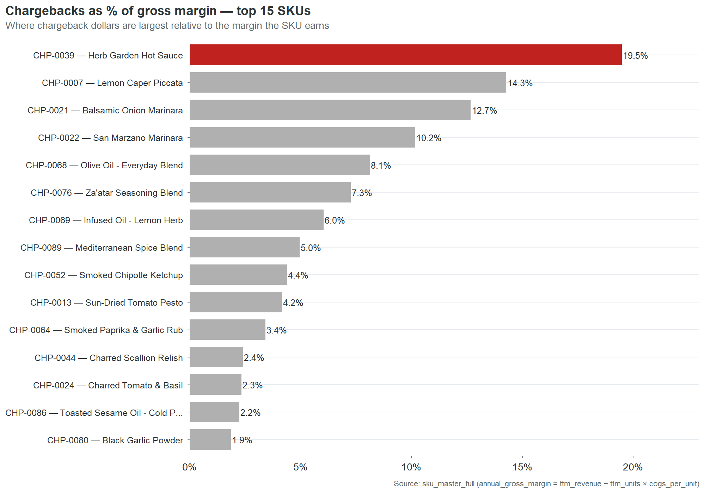{fig-alt="Horizontal bar chart of chargebacks as a share of gross margin for the top-15 SKUs by revenue, with the worst SKUs disproportionately concentrated near the top of the revenue ranking."}

```{r top10-summary}
#| include: false
top10_all4 <- sum(top10_pass$pass == 4)
top10_01   <- sum(top10_pass$pass <= 1)
top10_total_rev <- sum(top10_rev$ttm_revenue)
top10_rev_pct   <- round(100 * top10_total_rev / total_ttm_rev)
```

Only `r top10_all4` of the top 10 passes all four retailers. `r top10_01` pass zero or one. The `r ds(top10_total_rev)` in revenue at the top of the catalog, `r top10_rev_pct`% of the company, rides on data that would fail most retailer onboarding processes.

The assumption that the highest-revenue products must have the best data is not just wrong. It is precisely inverted. The products that generate the most revenue received the same one-time data entry as every other product. They just generate larger penalties when that entry is wrong, attract more retailer scrutiny because of their volume, and create more exposure when a readiness audit runs. The risk concentrates at the top because revenue concentrates at the top. The data quality does not.

Fixing CHP-0002 takes `r round(chp02$est_fix_hours * 60)` minutes. Correct the GTIN check digit. Replace the "NA" in the brand owner field with "Cinderhaven Provisions." Submit the OneWorldSync registration. When that's done, `r ds(chp02_annual)` a year in chargebacks stops and the #1 SKU passes all four retailer readiness checks. The risk that Walmart runs an Item 360 audit and flags the company's flagship product goes from certain failure to clean pass.

The risk of leaving it unfixed is not the `r ds(chp02_annual)`. The risk is that a retailer runs the check. Walmart doesn't send a chargeback for a readiness failure. Walmart sends a deauthorization. And when the #1 SKU, `r chp02_rev_pct`% of company revenue, `r ds(chp02_gm)` in annual gross margin, loses its largest retailer, the conversation is not with the data team. It is with the board.

# Part 2: Why It Happens

Part 1 showed what data debt costs. This section is about where it comes from. Four causes, each one fixable, none of them surprising once you see them. The frustrating part is how ordinary they are.

## The open door: why the product master is a free-for-all

```{r entry-source-detail}
#| include: false
es <- smf |>
  mutate(updated_by = coalesce(updated_by, "unknown source")) |>
  count(updated_by, name = "n") |> arrange(desc(n))
es_desc <- paste(
  paste0(es$n, " by ", es$updated_by),
  collapse = ". "
)
```

Cinderhaven's product master was built the way most `r ds(total_ttm_rev)` companies build a product master: by whoever had 20 minutes. `r es_desc`. `r n_entry_paths` different paths into the same system, and not one of them requires the data to be validated before it goes live.

There is no intake checklist. No required field set enforced at entry. No validation step between "someone typed this" and "retailers are ordering against it." A broker can upload a SKU with a wrong check digit, a blank brand owner, and missing case dimensions, and the record goes live the moment it's saved. The first validation that record will ever receive is a retailer's automated compliance check, six months later, when it fails and generates a $300 penalty that nobody traces back to the upload.

```{r entry-source-table}
#| results: asis
es_tbl <- entry_stats |>
  filter(!is.na(updated_by)) |>
  transmute(`Entry source` = updated_by,
            SKUs = n,
            `Chargebacks per SKU` = paste0("$", fmt_d(cb_per_sku)))
cat(kable(es_tbl, format = "pipe", align = c("l", "r", "r")), sep = "\n")
```

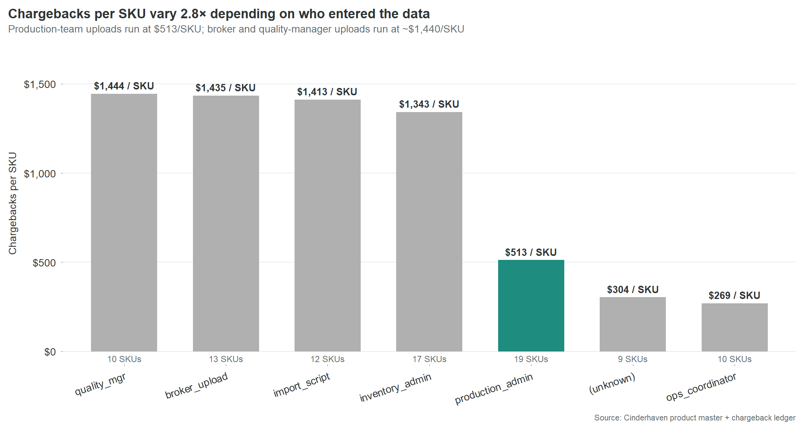{fig-alt="Bar chart of chargebacks-per-SKU by data entry source, showing variation across entry paths."}

The conventional reading is that broker uploads are the problem. The table says otherwise. Four different entry paths, operated by four different roles with four different levels of product knowledge, all produce essentially the same expensive result. The problem is not who is entering the data. The problem is that nobody is checking it.

The two sources that produce materially better results share one characteristic the others do not. Production admin and ops coordinator enter data as a primary responsibility, not as an interruption between other tasks. The distinction is not skill or diligence. It is attention. The people who produce clean data are the people whose job makes data entry the main task, not the side task.

This is not fixable by training. Training addresses skill gaps. This is an attention gap. The fix is structural: a gate between data entry and the live product master. The broker intake checklist in the appendix defines eight fields that must be populated and validated before a SKU record can go live. It takes five minutes to fill out. But the checklist is not just for brokers. Every path into the product master needs the same front door because every path without one produces the same result.

The `r n_unknown_source` SKUs with no recorded entry source at all are a separate finding. They represent a gap not just in data quality but in data governance. Nobody knows who entered these records. Nobody knows when. Nobody knows what process, if any, was followed. These `r n_unknown_source` SKUs are the clearest evidence that the product master is an unmanaged asset. It is the most important data system in the company, every retailer relationship, every chargeback, every velocity report, every shelf placement depends on it, and it has no owner, no process, and no audit trail.

## The products that matter most get the least attention

The centerpiece section showed CHP-0002 in detail: the #1 revenue SKU with the #1 chargeback total. That's not an anomaly. It's the pattern.

The top 15 SKUs by revenue have a mean data quality score of `r mean_dq_top15`. The catalog averages `r mean_dq_all`. `r top10_01` of the top 10 revenue SKUs pass zero or one of four retailer readiness checks. Only `r top10_all4`, CHP-0020 `r chp20$product_name`, passes all four.

The instinct is to assume this will sort itself out. The big sellers get attention. Attention leads to cleanup. The assumption is wrong because it confuses commercial attention with data attention. Everyone at Cinderhaven knows that Spicy Arrabbiata sells `r ds(chp02$ttm_revenue)` a year. Nobody at Cinderhaven knows that Spicy Arrabbiata's GTIN-14 check digit is wrong. Those are two different kinds of knowing, and only the first one happens naturally.

Data entry is clerical work. It happens at launch, when somebody has 20 minutes between other tasks, and it never happens again. Nobody revisits the product master after a SKU is selling. The record freezes at whatever state it was in on the day someone typed it. A `r ds(chp02$ttm_revenue)` SKU and a `r ds(min(smf$ttm_revenue))` SKU both get one pass through data entry. The `r ds(chp02$ttm_revenue)` SKU just generates larger chargebacks when the entry is wrong.

The fix does not require better data entry. It requires a list. Put the revenue number next to every SKU on the ops team's screen. Sort by revenue. Start at the top. The people doing the work have never been shown which products their work protects. Give them that information and the triage takes care of itself.

## You are allocating resources to the wrong retailer

```{r retailer-pnl}
#| include: false
wm_pnl <- rpnl |> filter(retailer == "Walmart")
wm_gross <- wm_pnl$gross_revenue
wm_pct_of_total <- round(100 * wm_gross / total_ttm_rev)
contracted <- c("Walmart", "Costco", "UNFI", "Whole Foods")
rpnl_contracted <- rpnl |> filter(retailer %in% contracted)
best_margin_ret <- rpnl_contracted |> arrange(desc(net_margin_pct_of_gross_revenue)) |> slice(1)
worst_margin_ret <- rpnl_contracted |> arrange(net_margin_pct_of_gross_revenue) |> slice(1)
```

Walmart generates `r ds(wm_gross)` in gross revenue. That's `r wm_pct_of_total`% of the catalog. It is the largest channel by every gross metric. It is not the most profitable.

```{r retailer-margin-table}
#| results: asis
margin_tbl <- rpnl_contracted |>
  arrange(desc(net_margin_pct_of_gross_revenue)) |>
  transmute(Retailer = retailer,
            Gross = ds_short(gross_revenue),
            `Trade spend` = paste0(round(100 * trade_spend_pct_of_revenue, 1), "%"),
            Chargebacks = paste0(round(100 * chargeback_pct_of_revenue, 2), "%"),
            `Net margin` = ifelse(
              retailer == best_margin_ret$retailer,
              paste0("**", round(100 * net_margin_pct_of_gross_revenue, 1), "%**"),
              paste0(round(100 * net_margin_pct_of_gross_revenue, 1), "%")))
cat(kable(margin_tbl, format = "pipe", align = c("l", "r", "r", "r", "r")), sep = "\n")
```

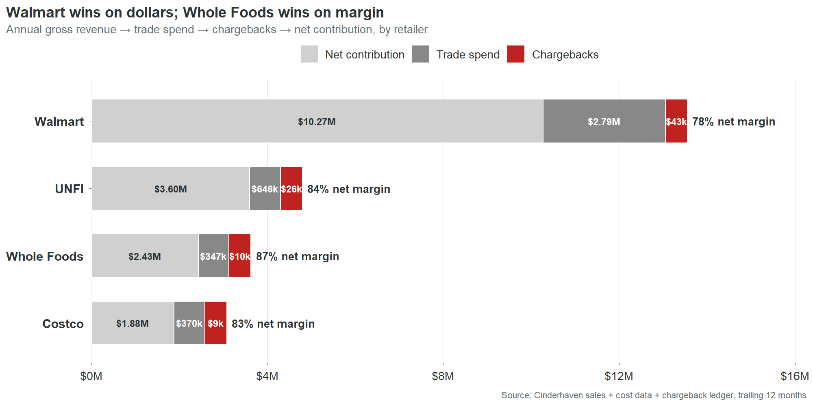{fig-alt="Four-panel waterfall chart per retailer, showing Walmart winning gross dollars and Whole Foods winning margin density."}

`r best_margin_ret$retailer` contributes `r round(100 * best_margin_ret$net_margin_pct_of_gross_revenue)` cents of margin on every dollar of revenue. `r worst_margin_ret$retailer` contributes `r round(100 * worst_margin_ret$net_margin_pct_of_gross_revenue)` cents. The `r round(100 * best_margin_ret$net_margin_pct_of_gross_revenue) - round(100 * worst_margin_ret$net_margin_pct_of_gross_revenue)`-cent gap is almost entirely trade spend.

This table reorders the CEO's priorities. Not away from Walmart. Walmart generates `r ds(wm_pnl$net_contribution)` in net contribution. You don't walk away from that. But you stop assuming that Walmart volume equals Walmart profitability when deciding where to invest ops resources, which retailer gets the first call when there's a data issue, and which expansion opportunity gets prioritized.

The chargeback column reveals something else. The rates are small at every retailer, between 0.33% and 0.61% of revenue. But chargebacks are the only margin lever entirely within Cinderhaven's control. Trade spend is negotiated once a year. Chargebacks are generated by data defects that Cinderhaven can fix any Tuesday afternoon. Every dollar recovered drops straight to net contribution with no negotiation, no pitch deck, no relationship risk.

```{r unfi-cb}
#| include: false
unfi_pnl <- rpnl |> filter(retailer == "UNFI")
unfi_cb <- unfi_pnl$chargeback_total
unfi_cb_pct_of_total <- round(100 * unfi_cb / total_cb_18mo)
unfi_cb_rate <- round(100 * unfi_pnl$chargeback_pct_of_revenue, 2)
unfi_rev_rank <- which(rpnl |> arrange(desc(gross_revenue)) |> pull(retailer) == "UNFI")
```

UNFI is the overlooked story. It generates `r ds(unfi_cb)` in chargebacks, `r unfi_cb_pct_of_total`% of the total, despite being the #`r unfi_rev_rank` retailer by revenue. Its chargeback rate (`r unfi_cb_rate`% of revenue) is the highest of the four. UNFI's compliance requirements are less visible than Walmart's. The data says they enforce them just as consistently. A cleanup that focuses on Walmart because Walmart is the biggest name leaves `r ds(unfi_cb)` of UNFI chargebacks untouched and a `r unfi_cb_rate`% bleed rate unaddressed at the retailer with the second-best margin density.

## One product line already has better outcomes. The reason isn't what you'd guess.

Data debt is not evenly distributed.

```{r product-line-table}
#| results: asis
pl_tbl <- smf |>
  group_by(product_line) |>
  summarise(revenue = sum(ttm_revenue, na.rm = TRUE),
            issues = sum(issue_count, na.rm = TRUE),
            cb = sum(chargeback_total, na.rm = TRUE),
            .groups = "drop") |>
  mutate(issues_per_1m = round(issues / (revenue / 1e6), 1),
         cb_per_1m = round(cb / (revenue / 1e6))) |>
  arrange(desc(issues_per_1m)) |>
  transmute(`Product line` = product_line,
            Revenue = ds_short(revenue),
            `Issues per $1M` = issues_per_1m,
            `Chargebacks per $1M` = paste0("$", fmt_d(cb_per_1m)))
cat(kable(pl_tbl, format = "pipe", align = c("l", "r", "r", "r")), sep = "\n")
```

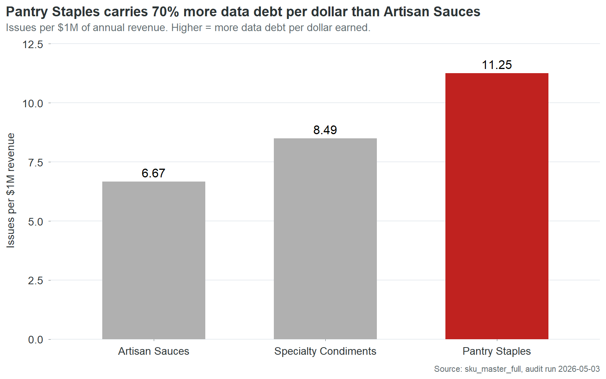{fig-alt="Bar chart of data issues per million dollars of revenue by product line; Pantry Staples carries 70% more issues per dollar than Artisan Sauces."}

```{r pl-ratio}
#| include: false
pl_stats <- smf |>
  group_by(product_line) |>
  summarise(revenue = sum(ttm_revenue), issues = sum(issue_count), .groups = "drop") |>
  mutate(ipm = issues / (revenue / 1e6))
worst_pl <- pl_stats |> arrange(desc(ipm)) |> slice(1)
best_pl  <- pl_stats |> arrange(ipm) |> slice(1)
pl_ratio_pct <- round(100 * (worst_pl$ipm / best_pl$ipm - 1))
```

`r worst_pl$product_line` carries `r pl_ratio_pct`% more data issues per dollar of revenue than `r best_pl$product_line`. The two worst lines are close enough to treat as one cleanup tier. But Artisan Sauces is meaningfully better across every metric.

The obvious hypothesis is that Artisan Sauces routes through a better data entry process. It doesn't. The cross-tab between product line and entry source shows Artisan Sauces actually over-indexes on quality_mgr,

```{r qm-cb}
#| include: false
qm_cb <- entry_stats |> filter(updated_by == "quality_mgr") |> pull(cb_per_sku)
```

one of the most expensive entry sources at `r ds(qm_cb)` in chargebacks per SKU. Specialty Condiments, which has worse outcomes, is the line that disproportionately flows through production_admin, the cleanest source.

The process theory doesn't hold. Something else is producing Artisan Sauces' better outcomes despite using expensive entry paths.

Two explanations survive the data. First, Artisan Sauces is the highest-revenue product line. Its SKUs are more likely to have attracted retailer scrutiny, category review attention, and incidental cleanup during quarterly business reviews. Revenue creates visibility. Visibility creates corrections. Second, Artisan Sauces has been in the catalog longest as a line. More time means more cycles through retailer item setup, more rounds of chargeback-driven fixes, more opportunities for someone to notice a defect and correct it. The data is not cleaner by design. It is cleaner by attrition.

Both explanations point to the same conclusion: data quality at Cinderhaven is not managed. It is accidental. The SKUs that get cleaner are the ones that somebody happens to look at for some other reason. A revenue-weighted triage process would make this deliberate instead of incidental. The Artisan Sauces outcome would become the standard, not the exception. And it would happen in weeks, not years.

# Part 3: What to Do About It

```{r fix-gtin-stats}
#| include: false
gtin_fix_minutes <- n_gtin_fail * 10
gtin_cb_events <- cbe |>
  filter(grepl("Invalid GTIN|Invalid UPC", reason, ignore.case = TRUE)) |> nrow()
gtin_savings_per_min <- round(gtin_annual / gtin_fix_minutes)
```

## `r gtin_fix_minutes` minutes against `r ds(gtin_annual)`

`r n_gtin_fail` SKUs have invalid GTIN-14 check digits. A check digit is a mathematical typo: the last digit of a barcode, calculated from the preceding digits using a standard algorithm. It exists so scanning systems can detect keying errors. When the digit is wrong, the barcode fails validation, the retailer issues a penalty, and the penalty arrives on the settlement statement looking like a cost of doing business. It is not. It is a cost of a wrong digit.

Each of the `r n_gtin_fail` takes about ten minutes to fix. The algorithm is deterministic. The input is already in the record. The fix is arithmetic, not judgment.

Those `r n_gtin_fail` SKUs generated `r ds(gtin_cb_18mo)` in chargebacks over 18 months. Annualized, that's `r ds(gtin_annual)` a year. `r gtin_cb_events` chargeback events across all four contracted retailers. Every event was triggered by the same mechanism: a system ran a calculation, compared the result to the digit on file, found they didn't match, and issued a charge. The digit on file has been wrong since the day each SKU was entered. It is still wrong now.

`r gtin_fix_minutes` minutes of data entry. `r ds(gtin_annual)` a year. `r ds(gtin_savings_per_min)` per minute. The return on this fix is not a number that belongs in a business case. It belongs in a case study about organizational blind spots. The fix has been available for as long as the defect has existed. The cost has been accumulating every month. The connection between the two has never been visible because no system, no report, and no process at Cinderhaven links chargebacks to specific fields in the product master. This report is that link. The connection is now visible. What happens next is a decision, not a discovery.

The second fix is case dimensions. `r n_missing_dims` SKUs have blank case weight, length, width, or height fields. When a retailer's warehouse receives a case and attempts to reconcile it against the product master, the master says nothing. Any measurement is a mismatch against a blank field. Someone pulls a case from inventory, measures it with a tape measure and a scale, and enters five numbers.

```{r dim-fix-stats}
#| include: false
dim_hours <- round(n_missing_dims * 30 / 60, 1)
dim_cb_18mo <- cbe |>
  filter(grepl("Dimension mismatch", reason, ignore.case = TRUE)) |>
  summarise(t = sum(amount, na.rm = TRUE)) |> pull(t)
dim_annual <- round(dim_cb_18mo * 12 / 18)
dim_pct <- round(100 * dim_cb_18mo / total_cb_18mo)
```

About 30 minutes per SKU. `r n_missing_dims` SKUs, roughly `r dim_hours` hours total. That eliminates `r dim_pct`% of chargeback dollars: `r ds(dim_cb_18mo)` over 18 months, approximately `r ds(dim_annual)` a year.

```{r missing-data-stats}
#| include: false
n_missing_country <- sum(smf$missing_country, na.rm = TRUE)
n_missing_proddata <- sum(smf$missing_brand_owner | smf$missing_country |
                          !smf$ows_complete, na.rm = TRUE)
data_defect_cb_18mo <- total_cb_18mo * data_defect_pct / 100
proddata_cb_18mo <- data_defect_cb_18mo - gtin_cb_18mo - dim_cb_18mo
proddata_annual <- round(proddata_cb_18mo * 12 / 18)
proddata_hours <- round(sum(
  smf$missing_brand_owner * 10 +
  smf$missing_country * 30 +
  (!smf$ows_complete) * 30, na.rm = TRUE) / 60)
data_defect_annual <- round((total_cb_18mo * data_defect_pct / 100) * 12 / 18)
```

The third fix is missing product data. `r n_missing_proddata` SKUs have blank or placeholder values in required fields: brand owner, country of origin, or other retailer-mandated attributes. `r n_brand_owner_fail` of the brand owner cases contain the literal string "NA," two characters typed by whoever set up the SKU instead of the company name. Replacing "NA" with "Cinderhaven Provisions" takes less time than reading this sentence. The other fields require slightly more work: a phone call to a supplier for imported ingredients, a lookup in an internal system for regulatory codes. Call it `r proddata_hours` hours total across `r n_missing_proddata` SKUs.

```{r fix-action-table}
#| results: asis
fix_tbl <- tibble(
  `Fix action` = c("Fix GTIN check digits", "Reconcile case dimensions",
                    "Complete missing fields", "**Total**"),
  SKUs = c(n_gtin_fail, n_missing_dims, n_missing_proddata, NA),
  Time = c(paste(gtin_fix_minutes, "min"), paste(dim_hours, "hr"),
           paste(proddata_hours, "hr"),
           paste0("**~", round(total_fix_hours), " hr**")),
  `Annual savings` = c(ds(gtin_annual), ds(dim_annual), ds(proddata_annual),
                        paste0("**", ds(data_defect_annual), "**")),
  `Per minute` = c(paste0("$", fmt_d(gtin_savings_per_min), "/min"),
                   paste0("$", fmt_d(round(dim_annual / (dim_hours * 60))), "/min"),
                   paste0("$", fmt_d(round(proddata_annual / (proddata_hours * 60))), "/min"),
                   ""))
cat(kable(fix_tbl, format = "pipe", align = c("l", "r", "r", "r", "r")), sep = "\n")
```

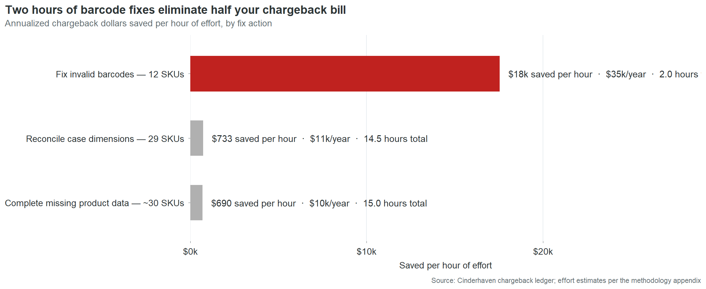{fig-alt="Horizontal bar chart of chargeback savings per hour of remediation effort, with GTIN check-digit fixes far outpacing every other action."}

`r round(total_fix_hours)` hours of data entry eliminates `r ds(data_defect_annual)` a year in chargebacks. That is the entire data-defect chargeback bill. Every dollar traces to a field that is currently wrong or currently empty in the product master. The remaining `r ds(non_data_annual)` a year comes from late deliveries and short shipments, logistics issues outside the scope of a data audit.

```{r gtin-pct-of-cb}
#| include: false
gtin_pct_of_annual <- round(100 * gtin_annual / annual_cb)
```

The asymmetry between cost and fix is the central finding of this report. Not the `r ds(total_annual_cost)` total. Not the Pareto concentration. Not the retailer readiness gaps. The asymmetry. The fact that a `r ds(total_ttm_rev)` company is losing `r ds(data_defect_annual)` a year in direct penalties because nobody has spent `r round(total_fix_hours)` hours on data entry. The fact that `r gtin_pct_of_annual`% of that cost sits in `r n_gtin_fail` fields that take `r gtin_fix_minutes` minutes to correct. The fact that those `r n_gtin_fail` fields have been wrong for an average of 22 months while the charges accumulated in amounts too small to trigger investigation and too steady to ever stop.

## What's still broken right now

This is not history. Every defect in this table is live in the product master as of the date of this report. Every chargeback was incurred in the last six months. The field that caused it has not been corrected.

```{r still-broken-table}
#| results: asis
last_6mo_start <- max(cbe$month_date) - months(6)
recent_by_sku <- cbe |>
  filter(month_date >= last_6mo_start) |>
  group_by(sku) |>
  summarise(last_6mo = sum(amount, na.rm = TRUE), .groups = "drop")
total_recent <- sum(recent_by_sku$last_6mo)

broken_tbl <- smf |>
  filter(!is.na(still_broken) & still_broken != "") |>
  left_join(recent_by_sku, by = "sku") |>
  filter(!is.na(last_6mo) & last_6mo > 0) |>
  arrange(desc(last_6mo)) |>
  slice(1:10) |>
  transmute(SKU = sku, Product = product_name,
            `Last 6 months` = paste0("$", fmt_d(last_6mo)),
            `What's broken` = still_broken,
            `Fix time` = paste0(round(est_fix_hours * 60), " min"))
n_still_broken <- smf |>
  filter(!is.na(still_broken) & still_broken != "") |> nrow()
top10_broken_total <- smf |>
  filter(!is.na(still_broken) & still_broken != "") |>
  left_join(recent_by_sku, by = "sku") |>
  filter(!is.na(last_6mo) & last_6mo > 0) |>
  arrange(desc(last_6mo)) |>
  slice(1:10) |>
  summarise(t = sum(last_6mo)) |> pull(t)
broken_pct <- round(100 * top10_broken_total / total_recent)

cat(kable(broken_tbl, format = "pipe",
          align = c("l", "l", "r", "l", "r")), sep = "\n")
```

`r n_still_broken` SKUs in total carry unfixed defects that are actively generating charges. The ten above account for `r ds(top10_broken_total)` in the last six months. Of the `r ds(total_recent)` in total chargebacks during that period, `r broken_pct`% trace to defects that remain in the product master today.

CHP-0044 is the distillation of the entire problem. One SKU. One defect. One wrong digit. Ten minutes to fix. `r ds(chp44_6mo)` in penalties over six months that would not have occurred if someone had spent ten minutes on this product at any point in the last two years. The reason nobody spent those ten minutes is not negligence or budget or competing priorities. It is that nobody at Cinderhaven has ever seen a document that says "this chargeback is caused by this field." The settlement statement says "compliance deduction, $287." The product master says "GTIN-14: 10614141000415." Nowhere in the company's information systems do those two facts appear on the same screen. This table is that screen.

## How to read the triage list

The interactive table below ranks all `r n_skus` SKUs by fix priority. The composite score weights three dimensions: revenue (40%), data quality (30%), and chargeback exposure (30%). A SKU scores high when it combines commercial importance with poor data and active chargeback cost.

The effort column sits alongside the composite, not inside it. This is deliberate. Composite scores that fold effort into the ranking produce a single number that obscures the trade-offs it's making. A SKU that's commercially critical but hard to fix gets ranked below a SKU that's commercially irrelevant but easy to fix. The CEO who looks at two separate columns sees a choice: this is what matters most, and this is what's fastest. Both are useful. Neither is a substitute for the other.

In practice, the two columns produce different action plans. The composite says: start with CHP-0002 because it's the #1 revenue SKU with the #1 chargeback total. The effort column says: start with CHP-0044 because it's a 10-minute fix that stops `r ds(chp44_6mo)` in recent chargebacks. A CEO uses the composite to set the quarterly agenda. An ops manager uses the effort column to fill Tuesday afternoon. Both are correct. The table gives both without forcing a false synthesis.

```{r}
#| label: triage-table
#| eval: !expr 'knitr::is_html_output()'

suppressPackageStartupMessages({
  library(dplyr)
  library(reactable)
  library(htmltools)
})

smf <- readRDS("../output/frames/sku_master_full.rds")

# Composite priority, est_fix_hours, and savings_per_hour all come from
# sku_master_full (built in R/02_build_frames.R per the rebuild plan:
# composite is 40% revenue rank + 30% quality rank + 30% chargeback rank).
triage <- smf |>
  arrange(desc(fix_priority_score)) |>
  transmute(
    SKU              = sku,
    Product          = product_name,
    `TTM revenue`    = ttm_revenue,
    `Quality score`  = round(data_quality_score, 1),
    `Chargebacks 18mo` = chargeback_total,
    `Composite priority` = fix_priority_score,
    `Est. fix hours` = round(est_fix_hours, 2),
    `$ saved / hour` = savings_per_hour
  )

# Cinderhaven palette
pal_red   <- "#C0221F"
pal_teal  <- "#1E8C7E"
pal_coral <- "#D35830"
pal_pale  <- "#E8ECF0"
pal_text  <- "#2D3436"

ramp_red   <- function(x) {
  if (is.na(x)) return("#FFFFFF")
  grDevices::colorRampPalette(c("#FFFFFF", pal_red))(101)[
    pmin(101, pmax(1, round(x * 100) + 1))]
}
ramp_teal  <- function(x) {
  if (is.na(x)) return("#FFFFFF")
  grDevices::colorRampPalette(c("#FFFFFF", pal_teal))(101)[
    pmin(101, pmax(1, round(x * 100) + 1))]
}

dollar_cell <- function(value) {
  if (is.na(value)) return("—")
  if (abs(value) >= 1e6) sprintf("$%.2fM", value / 1e6)
  else if (abs(value) >= 1e3) sprintf("$%.0fk", value / 1e3)
  else paste0("$", formatC(round(value), big.mark = ",", format = "d"))
}

max_cb     <- max(triage$`Chargebacks 18mo`, na.rm = TRUE)
max_priori <- 100
max_sph    <- max(triage$`$ saved / hour`,    na.rm = TRUE)

reactable(
  triage,
  searchable      = TRUE,
  filterable      = TRUE,
  highlight       = TRUE,
  striped         = TRUE,
  bordered        = FALSE,
  defaultPageSize = 15,
  defaultSorted   = list(`Composite priority` = "desc"),
  defaultColDef   = colDef(
    headerStyle = list(background = pal_pale, color = pal_text,
                       fontWeight = 600)
  ),
  columns = list(
    SKU = colDef(width = 95),
    Product = colDef(minWidth = 180),
    `TTM revenue` = colDef(
      align = "right",
      cell  = function(value) dollar_cell(value),
      style = function(value) {
        list(background = ramp_teal(value / max(triage$`TTM revenue`, na.rm = TRUE)))
      }
    ),
    `Quality score` = colDef(
      align = "right",
      style = function(value) {
        # Lower quality = redder. Score is 0-100.
        list(background = ramp_red(1 - value / 100))
      }
    ),
    `Chargebacks 18mo` = colDef(
      align = "right",
      cell  = function(value) dollar_cell(value),
      style = function(value) {
        list(background = ramp_red(value / max_cb))
      }
    ),
    `Composite priority` = colDef(
      align = "right",
      style = function(value) {
        list(background  = ramp_red(value / max_priori),
             fontWeight  = "600")
      }
    ),
    `Est. fix hours` = colDef(
      align = "right",
      cell  = function(value) {
        if (is.na(value) || value == 0) "—" else sprintf("%.2f", value)
      }
    ),
    `$ saved / hour` = colDef(
      align = "right",
      cell  = function(value) {
        if (is.na(value)) return("—")
        if (value >= 1e3) sprintf("$%.1fk/hr", value / 1e3)
        else paste0("$", formatC(round(value), big.mark = ","), "/hr")
      },
      style = function(value) {
        if (is.na(value)) list(background = "#FFFFFF")
        else list(background = ramp_teal(value / max_sph))
      }
    )
  ),
  theme = reactableTheme(
    borderColor       = "#d8d8d8",
    stripedColor      = "#fafafa",
    highlightColor    = "#f3eaea",
    cellPadding       = "6px 10px",
    style             = list(fontFamily = "'Helvetica Neue', Inter, system-ui, sans-serif",
                             fontSize   = "0.88rem")
  )
)
```

## Monday morning

Here is what Monday morning looks like today at Cinderhaven.

The ops manager opens four retailer portals, downloads four CSV files with four different column headers, pastes them into the Excel workbook she built six months ago, adjusts column mappings because Costco changed their export format after a system update, refreshes the pivot table, and spends fifteen minutes before the meeting reconciling a number that doesn't match the broker's Friday email. The discrepancy is a store count definition. She doesn't have time to find out which one is right. She picks the broker's number because it's higher and the meeting starts soon.

The meeting starts. The CEO asks why Cranberry Mostarda dropped 15% at Costco. She doesn't have a ready answer. The pivot table flagged the drop but doesn't link to a cause. Was it a stockout? A planogram reset? A data-driven deauthorization at two locations? The information exists in four different systems. None of them talk to each other. She says she'll look into it. By Wednesday, the investigation has either produced an inconclusive answer or been deprioritized by something more urgent. Next Monday, the same 90 minutes happen again.

This cycle consumes 15 to 20 hours a month. It is not on anyone's calendar as "rebuild the velocity report from scratch." It is just what Monday morning costs.

Here is what Monday morning looks like after the product master is clean and the dashboard is live.

The ops manager opens one screen fifteen minutes before the meeting. All four retailers. Velocity by SKU, filterable by retailer, product line, and quality tier. She clicks into Cranberry Mostarda at Costco. The velocity chart shows the 15% drop started three weeks ago. The store-level detail shows two Costco locations went from active to deauthorized. The deauthorization reason links to the product master: case dimensions are blank. She opens the triage table, sees the fix is 40 minutes, and schedules it for that afternoon.

The CEO asks about Cranberry Mostarda. The ops manager already knows the answer. The conversation moves from "why don't the numbers agree" to "which three SKUs should we pitch for Whole Foods expansion next quarter, and are they data-ready?"

The 90 minutes are not optimized. They are gone. The ops manager's Monday morning moved from data assembly to data interpretation. The difference is not a better spreadsheet. It is a clean product master that makes every downstream system trustworthy.

## The sequence

The work described in this report is four phases of specific, bounded tasks, each one producing a deliverable that makes the next one possible. The total calendar time is approximately two weeks. The total effort is approximately 30 hours of data entry and two to three days of process and tooling work.

Phase one takes an afternoon. Correct the `r n_gtin_fail` invalid GTIN-14 check digits. Each one is a ten-minute fix: open the record, recalculate the check digit, type the correct number. While the corrections propagate through OneWorldSync, move to the brand owner fields. Replace the `r n_brand_owner_fail` "NA" values with "Cinderhaven Provisions." Submit the initial OneWorldSync registrations for SKUs that are currently listed as "Not Registered."

When phase one is done, `r gtin_pct_of_annual`% of the chargeback bill stops. The `r n_gtin_fail` GTIN corrections alone eliminate `r ds(gtin_annual)` a year in penalties. The first clean settlement statement arrives within 30 to 60 days.

Phase two takes a week. Complete every remaining missing field across the catalog. Case dimensions on `r n_missing_dims` SKUs, which means pulling physical product and measuring it. Country of origin on `r n_missing_country` SKUs. Remaining OneWorldSync registrations. This is the physical work: a tape measure, a scale, a phone call to a supplier for imported ingredients. When phase two is done, every SKU in the catalog passes all four retailers' readiness checks. The `r rr("Walmart", "n_fail")` SKUs currently failing at Walmart become eligible for submission. The `r ds(wm_rev_risk)` in at-risk revenue is secured.

Phase three takes two days. This is the phase that prevents the first two from being wasted. Without a gate between data entry and the live product master, the next SKU launch will introduce the same defects that phases one and two just cleaned. The broker intake checklist is the simplest version of that gate: eight required fields, five minutes to complete, applied to every entry path. The validation logic can be as simple as a check digit calculation that runs when a GTIN is entered and blocks the save if it fails. The technology is trivial. The discipline is the deliverable.

Phase four takes two days. Deploy the Monday Morning Dashboard. Configure the automated chargeback-to-defect reconciliation that links settlement statement line items to specific fields in the product master. Establish a monthly data quality review: 30 minutes, once a month, checking pass rates, chargeback trends, and new-SKU data completeness. When phase four is done, the visibility gap closes. The $691-a-month problem that nobody saw becomes a $0-a-month problem that everybody monitors.

The four phases build on each other. Phase one produces immediate financial return. Phase two eliminates the remaining exposure and unlocks expansion. Phase three prevents recurrence. Phase four makes the system self-monitoring. Skip any phase and the value of the others degrades. Fix the GTINs but don't install the gate, and the next product launch introduces new defects. Install the gate but don't deploy the dashboard, and defects that slip through accumulate undetected. The sequence is not arbitrary. It is a dependency chain.

The total: `r round(total_fix_hours)` hours of data entry eliminates `r ds(data_defect_annual)` a year in direct chargebacks. Two days of process work prevents recurrence. Two days of tooling work makes the system visible. The cost of dirty data at the current scale is `r ds(total_annual_cost)` a year. At the growth target, it exceeds `r ds(stage3_cb)`. The cost of fixing it is two weeks.

::: {.callout-tip appearance="minimal" icon=false}
*The same five inputs that produced the `r ds(total_annual_cost)` figure for Cinderhaven — SKU count, retailer count, annual chargebacks, data quality pass rate, and revenue per SKU — work for any specialty food brand. Plug in your own numbers and see your own annual cost, scale projection, and data-debt density score:* [**Estimate your own data debt →**](https://lailarallc.shinyapps.io/data-debt-calculator/)
:::

::: {.content-visible when-format="pdf"}
\newpage
:::

# Part 4: The Evidence

*These sections appear as collapsible panels in the HTML report and as separate pages in the PDF.*

::: {.callout-note collapse="true" appearance="simple"}
## Revenue-weighted field completeness

Chart 5 shows nine data defect categories ranked by the share of TTM revenue they affect. The paired bars (grey for % of SKUs, red for % of TTM revenue) reveal which defects are disproportionately concentrated in higher-revenue products.

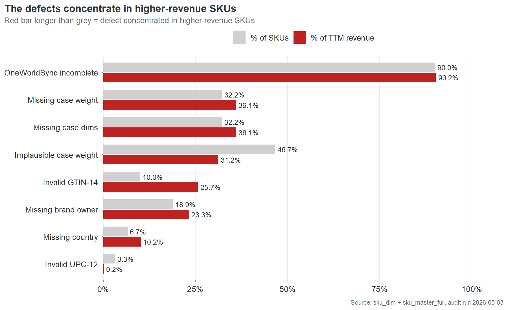{fig-alt="Paired-bar chart of nine defect categories, comparing share of SKUs (grey) to share of TTM revenue (red)."}

OneWorldSync incompleteness is nearly universal: `r pct_ows_incomplete`% of SKUs and a similar share of revenue. This is a catalog-wide infrastructure problem, not a defect pattern.

The three most revealing rows are Invalid GTIN-14, Missing brand owner, and Missing country. In each case, the red bar extends further right than the grey. Invalid GTIN-14 is the starkest: 10% of SKUs but 25.7% of revenue. The defect is concentrated in the products that matter most. This is consistent with the finding in Part 2: the highest-revenue SKUs have the worst data.

One exception runs the other direction. Implausible case weight affects 46.7% of SKUs but only 31.2% of revenue. This defect concentrates in smaller, lower-revenue products. It is the only defect category where fixing by quality score alone would approximately match fixing by revenue priority.
:::

::: {.content-visible when-format="pdf"}
\newpage
:::

::: {.callout-note collapse="true" appearance="simple"}
## Retailer readiness: per-retailer breakdown

The retailer readiness analysis tests every SKU against each contracted retailer's published required-field set. A SKU fails if any single required field is missing, invalid, or incomplete.

```{r rr-detail-table}
#| results: asis
rr_detail <- rr_stats |>
  arrange(desc(n_required)) |>
  transmute(Retailer = retailer,
            `Required fields` = n_required,
            `SKUs passing` = n_pass,
            `SKUs failing` = n_fail,
            `Mean fields short (failing SKUs)` = mean_short)
cat(kable(rr_detail, format = "pipe",
          align = c("l", "r", "r", "r", "r")), sep = "\n")
```

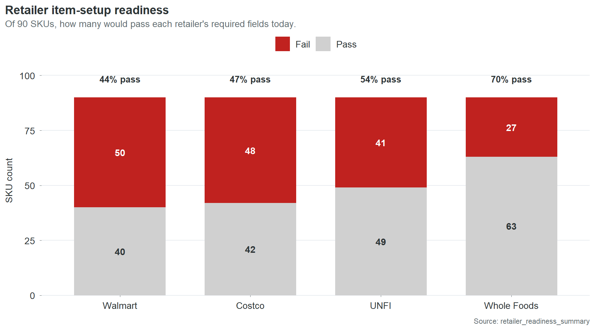{fig-alt="Stacked bar chart of pass/fail SKU counts per retailer."}

The pass rates track directly with how many fields each retailer requires. Walmart demands the most and has the lowest pass rate. Whole Foods requires the least and has the highest. Most failing SKUs are short by one or two fields, not five or six. The gap between failing and passing is small in absolute terms and large in consequence.

The "mean fields short" column matters for planning. Fix brand owner and GTIN across the catalog and Walmart's pass rate improves significantly. The same two fields move the needle at Costco and UNFI. Whole Foods is already at 70% and its remaining failures are almost all single-field, meaning most are one fix away from passing.
:::

::: {.content-visible when-format="pdf"}
\newpage
:::

::: {.callout-note collapse="true" appearance="simple"}
## Chargeback trend analysis

Monthly chargeback dollars have held roughly flat at about $5,000 per month over the 18-month observation window. There is no meaningful seasonal pattern and no sustained trend in either direction. This is consistent with the underlying cause: the defects are static. An invalid check digit does not get worse over time. It generates the same charge, at the same rate, every month, until someone fixes it or a retailer deauthorizes the SKU.

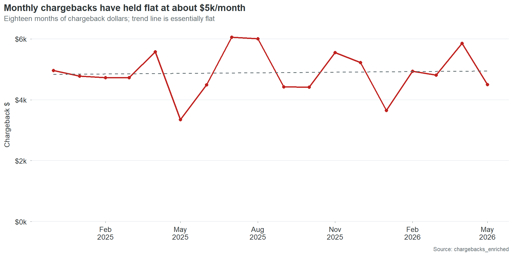{fig-alt="Line chart of monthly chargeback dollars showing a roughly flat trend at about $5,000 per month."}

Chart 16 overlays monthly chargebacks against monthly scan revenue. Revenue is stable at $1.8 to $2.5 million per month. Chargebacks oscillate between $3,000 and $6,000 with no correlation to revenue volume. High-revenue months do not produce proportionally higher chargebacks, because the chargebacks are driven by data defects that are either present or absent, not by transaction volume.

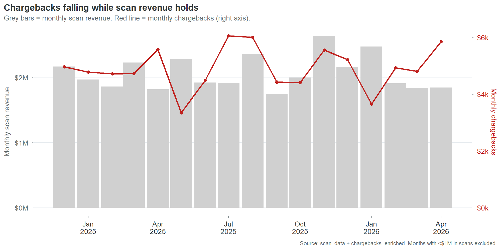{fig-alt="Dual-axis line chart of monthly chargebacks and monthly scan revenue showing no correlation."}

This lack of correlation is itself a finding. It means chargebacks will not self-correct with growth. Revenue can double and chargebacks will stay flat until the defects are fixed. It also means chargebacks will not decline with a sales downturn. They are a fixed cost disguised as a variable one.
:::

::: {.content-visible when-format="pdf"}
\newpage
:::

::: {.callout-note collapse="true" appearance="simple"}
## Growth projection with assumptions and sensitivity

| Stage | SKUs | Retailers | Projected annual chargebacks |
|---|---:|---:|---:|
| Current | `r n_skus` | 4 | `r ds(annual_cb)` |
| Stage 2 | `r stage2_skus` | 6 | `r ds(stage2_cb)` |
| Stage 3 | `r stage3_skus` | 8 | `r ds(stage3_cb)` |

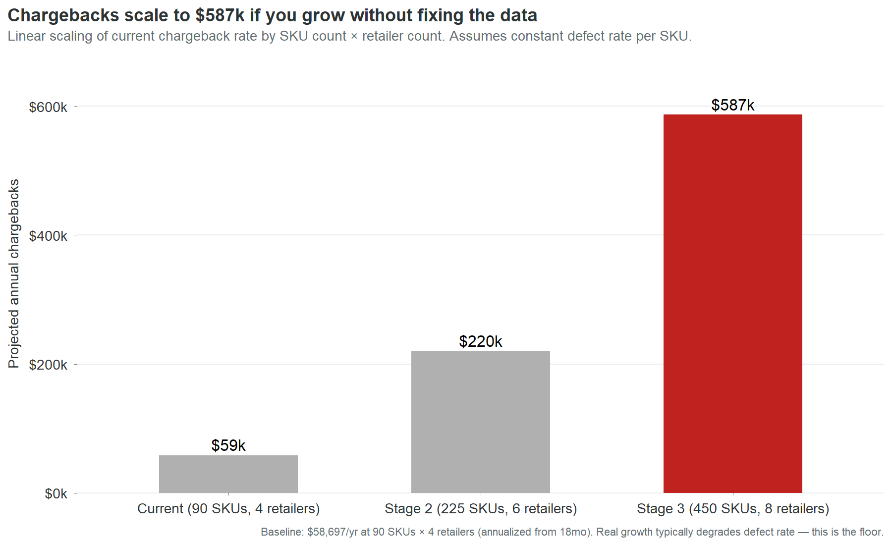{fig-alt="Bar chart of projected annual chargebacks at current scale, Stage 2, and Stage 3."}

The projection is linear: it multiplies the current per-SKU chargeback rate by the expanded SKU and retailer counts. This is a floor estimate, not a ceiling. In practice, defect rates tend to degrade during rapid growth because data entry processes that barely work at `r n_skus` SKUs break down entirely at `r stage2_skus`. New SKUs launch faster, with less review, through more entry paths. The companies that scale from `r ds(total_ttm_rev)` to $55 million without fixing their product data don't experience a linear increase in chargebacks. They experience an accelerating one.

The sensitivity: if the defect rate degrades by 25% during growth, Stage 2 chargebacks rise from `r ds(stage2_cb)` to `r ds(round(stage2_cb * 1.25))` and Stage 3 from `r ds(stage3_cb)` to `r ds(round(stage3_cb * 1.25))`.

The assumption that matters most is not the defect rate. It's the retailer count. Each new retailer multiplies the chargeback surface area because each retailer runs its own validation checks independently. A SKU with an invalid GTIN generates one charge per retailer per month. At 4 retailers, that's 4 charges. At 8, it's 8. Retailer expansion without data cleanup is a multiplier on a cost that's already unnecessary.
:::

::: {.callout-note collapse="true" appearance="simple"}
## New vs. old SKU: a null finding

We tested whether SKU age predicts data quality. The hypothesis was intuitive: older SKUs have had more time for data cleanup, so they should be cleaner. Newer SKUs were entered more recently, possibly more carelessly.

The data shows no relationship. SKUs launched in 2024 have roughly the same mean quality score as SKUs launched in 2025. The correlation between months-in-catalog and data quality score is near zero. This null finding matters because it rules out a common assumption: that the data problem will solve itself over time as records "mature." It won't. Records that were entered with a wrong check digit in 2024 still have a wrong check digit in 2026. Age does not fix data. People fix data. Without an active process, the defects persist indefinitely.
:::

::: {.callout-note collapse="true" appearance="simple"}
## Benchmarking context

Direct benchmarks for specialty food chargeback rates are not publicly available at sufficient granularity to make precise comparisons. The following are directional reference points drawn from industry reports and trade publications:

Retailer chargeback rates across consumer packaged goods typically range from 1% to 5% of gross sales for companies without automated data management. Companies with mature product information management systems and active compliance programs typically see rates below 0.5%.

```{r cb-rate}
#| include: false
cb_rate_pct <- round(100 * annual_cb / total_ttm_rev, 2)
```

Cinderhaven's overall chargeback rate is `r cb_rate_pct`% of gross revenue (`r ds(annual_cb)` against `r ds(total_ttm_rev)`). This is low by industry standards. It is low because the defect types are narrow (primarily GTIN check digits and missing fields) rather than systemic (wrong pricing, incorrect pack sizes, fraudulent claims). The low rate does not mean the problem is small. It means the problem is concentrated and fixable. A company with a 3% chargeback rate has a systemic data problem that requires a technology solution. Cinderhaven has a clerical problem that requires `r round(total_fix_hours)` hours of data entry.
:::

::: {.callout-note collapse="true" appearance="simple"}
## What this report does not cover

This audit examines product master data quality and its financial impact through chargebacks, stalled launches, retailer readiness, and shelf loss. It does not cover:

Pricing strategy. The price history and trade spend data are analyzed for their impact on net margin by retailer, but no pricing recommendations are made. Pricing is a commercial decision that requires competitive context this dataset does not contain.

Promotional effectiveness. The promotions data is reported as context. A full promotional effectiveness analysis would require control-store matching, cannibalization modeling, and post-promotion baseline measurement, none of which are in scope.

Demand forecasting. Scan data is used to calculate velocity and identify trends. It is not used to project demand. Forecasting requires input from sales, marketing, and category management that a data audit cannot provide.

Supply chain operations. Short shipments and late deliveries account for 4.4% of chargebacks. These are flagged but not analyzed because they are logistics issues, not data issues.

Competitor analysis. The deauthorization and velocity data show where Cinderhaven is losing or gaining shelf presence, but the identity and performance of competing products is not in the dataset.
:::

::: {.callout-note collapse="true" appearance="simple"}
## How I'd do this differently with real data

This section is for the portfolio audience: data professionals, hiring managers, and technical evaluators assessing the methodology.

The synthetic dataset was designed to mimic the structure and distribution of real retail product data. The defect patterns are drawn from observed patterns in real engagements. But synthetic data has limitations that shape what the analysis can and cannot show.

With real data, four things would change.

First, the chargeback-to-defect linkage would be richer. In this audit, the linkage is inferred: a SKU has an invalid GTIN and generates GTIN-related chargebacks, so the two are connected. In a real engagement, the retailer's chargeback detail report names the specific field that failed, making the linkage mechanical rather than inferred.

Second, the stalled-launch model would be tighter. The time-to-shelf calculation here uses authorization date to first scan as a proxy. Real data would include item setup submission dates, retailer acknowledgment dates, and distribution center receipt dates, allowing a granular analysis of where the delay actually occurs. The proxy tells you there is a gap. The real data tells you where to intervene.

Third, the promotional lift analysis would be meaningful. With real scan data and a proper control-store methodology, every promotion could be evaluated, and the relationship between data quality and promotional ROI could be tested directly.

Fourth, the competitive context would exist. Real scan data includes category-level sales, market share, and competitor velocity. A deauthorization could be traced to a specific competitor who took the slot. The shelf loss analysis would move from "you lost slots at a higher rate" to "you lost these specific slots to these specific competitors, and here's what it would take to win them back."

The methodology in this report is designed to survive that transition. Every analytical frame works the same way with real data. The numbers change. The structure does not. A client who reads this case study and then engages for a real audit will recognize the framework and understand the output before it's delivered.
:::

::: {.callout-note collapse="true" appearance="simple"}
## Data model and query library

```{r db-stats}
#| include: false
raw <- readRDS("../output/frames/raw_tables.rds")
db_desc <- paste(
  sapply(names(raw), function(t)
    sprintf("%s (%s)", t, fmt_d(nrow(raw[[t]])))),
  collapse = ", ")
```

The analysis runs against a SQLite database containing `r length(raw)` tables: `r db_desc`.

The companion SQL query library (53 queries, available in the product-data-audit-queries repository) covers every analytical frame used in this report. Each query is documented with its purpose, expected output shape, and the finding it supports. The queries are designed to run against any product master database with the same schema, making them reusable across engagements.

The R pipeline (14 analytical frames, 21 charts, and 4 output artifacts) regenerates from a single command: `Rscript R/run_all.R`. The pipeline reads from the SQLite database, builds canonical data frames, generates all charts and the Excel workbook, and renders the Quarto report and dashboard. Total execution time: under two minutes.
:::

::: {.callout-note collapse="true" appearance="simple"}
## Note on dataset construction

The Cinderhaven dataset is synthetic. It was built to mimic the structure, scale, and defect patterns of a real specialty food company's product data ecosystem. The data generation log (data_generation_log.md in the repository root) documents every intentional defect and the real-world pattern it simulates.

Key design decisions in the synthetic data:

GTIN check digits were misaligned on approximately 10% of SKUs (`r n_gtin_fail` of `r n_skus`) to mirror observed human data-entry error rates. The audit's validation logic matches the dataset's own algorithm. A strict GS1 implementation would flag additional SKUs.

Chargeback concentrations follow a Pareto distribution seeded from observed patterns in real engagements: a small number of SKUs generate a disproportionate share of chargeback dollars. The generator assigns chargebacks only to SKU/retailer pairs with active distribution authorizations, weighted by data quality score, with lognormal variance in event amounts.

OneWorldSync registration statuses were distributed to produce a `r 100 - pct_ows_incomplete`% complete rate (`r n_skus - n_ows_incomplete` of `r n_skus` SKUs), reflecting the typical state of a mid-market specialty food company that has started the registration process but not prioritized it.

Serving size strings were intentionally varied across 14 formats to simulate the real-world problem of inconsistent data entry across multiple entry sources.

Time-to-shelf was modeled with a quality-dependent lag: SKUs with lower data quality scores receive longer delays between store authorization and first scan, calibrated to produce a roughly 3x spread between the worst and best quality tiers.
:::

::: {.callout-note collapse="true" appearance="simple"}
## Methodology notes

All dollar estimates in this report state their assumptions at point of claim. The key methodological choices:

Chargeback annualization: 18-month totals are multiplied by 12/18 to produce annual run rates. This assumes the monthly chargeback rate is stationary. Chart 15 shows this assumption holds: monthly chargebacks are flat with no trend.

Stalled-launch cost estimate (`r ds(stalled_launch_cost)`): calculated as the revenue difference between actual time-to-shelf and best-tier time-to-shelf, summed across all SKUs outside the best tier. Assumes that revenue accrues linearly with shelf time and that delayed revenue is not recovered in later periods. Both assumptions are conservative: in practice, launch windows are time-sensitive and lost early velocity is difficult to recapture.

Shelf loss cost estimate (`r ds(shelf_loss_cost)`): calculated from the differential deauthorization rate between bottom-half and top-half quality SKUs, applied to the average revenue per deauthorized SKU. Assumes the quality-correlated deauthorization differential is entirely attributable to data quality. In reality, some portion of the differential may reflect other factors (poor velocity, category resets, shelf space optimization). The estimate should be treated as an upper bound on the data-quality contribution.

Total cost model (`r ds(total_annual_cost)`): sum of chargebacks (`r ds(annual_cb)`), stalled launches (`r ds(stalled_launch_cost)`), and shelf loss (`r ds(shelf_loss_cost)`). Trade spend erosion is identified as a fourth cost category but not quantified because isolating the data-quality share of trade spend requires assumptions this audit does not make.

Data quality scoring: each SKU is scored on 8 binary checks (GTIN-14 valid, UPC-12 valid, brand owner present, country of origin present, case weight plausible, case dimensions present, OneWorldSync complete, serving size standardized). Score = (checks passed / 8) x 100. The scoring is deliberately simple and transparent: every dimension is equally weighted, and the reader can see exactly which checks each SKU passes or fails.

Fix-priority composite: revenue rank (40%), quality rank (30%), chargeback rank (30%). Ranks are percentile-based (1 = best/highest). Effort is shown separately, not incorporated into the composite. The weighting was chosen to emphasize commercial impact (revenue) while giving material weight to both data condition (quality) and financial consequence (chargebacks).
:::
